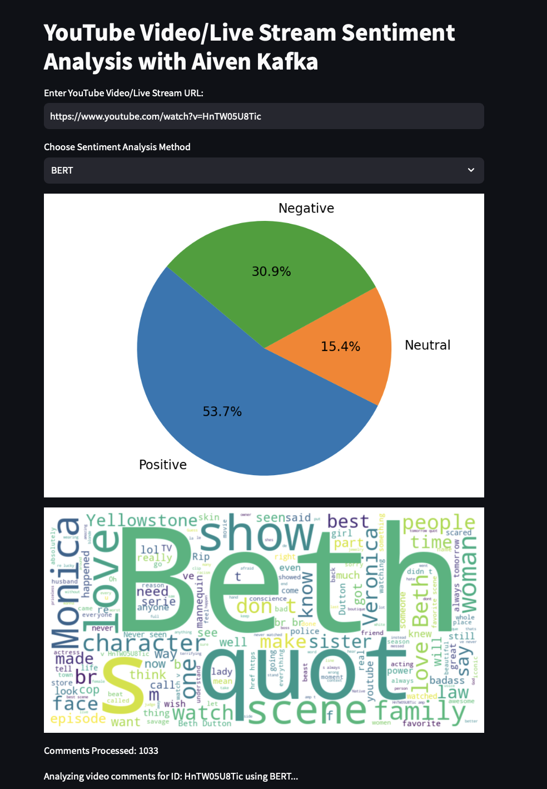

# 🎥 YouTube Sentiment Analyzer with Kafka Streaming

A real-time YouTube video and live stream sentiment analysis dashboard built using:

* 🧠 **TextBlob**, **BERT**, and **Azure Cognitive Services** for multi-model sentiment analysis
* 🟢 **Aiven Kafka** for comment streaming and message queuing
* 📊 **Streamlit** for live dashboarding
* ☁️ **YouTube Data API v3** for fetching comments and live chats
* 🔒 SSL-secured Kafka for production-level deployment

---

## 🚀 Features

* 🔎 Analyze **YouTube video** or **live stream** comments in real-time
* 🧪 Choose between 3 sentiment engines:

  * **TextBlob** – lightweight and quick
  * **BERT (Multilingual)** – transformer-based deep learning model
  * **Azure Text Analytics** – enterprise-level API integration
* 📊 Live visualizations:

  * Pie chart for sentiment distribution
  * Word cloud of frequently used words
* 🔁 Kafka integration for streaming comments to topics:

  * `youtube-video-comments`
  * `youtube-live-comments`

---

## 🛠️ Setup Instructions

### 1. 🔐 Prerequisites

* Python 3.8+
* Aiven Kafka account with SSL credentials
* Azure Cognitive Services key and endpoint (Text Analytics)
* YouTube Data API v3 key

### 2. ⚙️ Environment Variables

Create a `.env` file in your project root with the following content:

```env
YOUTUBE_API_KEY=your_youtube_api_key
AZURE_KEY=your_azure_text_analytics_key
AZURE_ENDPOINT=https://your-resource-name.cognitiveservices.azure.com/

KAFKA_BOOTSTRAP_SERVERS=your_aiven_kafka_bootstrap_url
AIVEN_CA_PATH=/path/to/ca.pem
AIVEN_CERT_PATH=/path/to/service.cert
AIVEN_KEY_PATH=/path/to/service.key
```

### 3. 📆 Install Dependencies

Install all required packages using pip:

```bash
pip install -r requirements.txt
```

Sample `requirements.txt`:

```txt
streamlit
kafka-python
google-api-python-client
textblob
transformers
torch
azure-ai-textanalytics
azure-core
python-dotenv
wordcloud
matplotlib
```

---

## 🧠 How It Works

1. User inputs a YouTube video or live stream URL.
2. The app determines if it's a video or live stream and fetches comments accordingly.
3. Each comment is:

   * Analyzed for sentiment using selected method
   * Sent to Kafka topic for downstream processing
   * Counted and visualized in real-time
4. Dashboard updates sentiment distribution and comment word cloud every few seconds.

  
*System architecture showing sentiment engine, Kafka flow, and dashboard integration*
---

## 📸 Dashboard UI

Here’s a preview of the interactive Streamlit dashboard:

  

  

  

  

  

  


---

## 🛄 Kafka Topics

* `youtube-video-comments` – for video comments
* `youtube-live-comments` – for live stream chats

---

## 📌 Notes

* Azure API may incur costs beyond free tier.
* BERT model is resource-intensive. A GPU is recommended for large-scale usage.
* Kafka SSL files (CA, CERT, KEY) must be stored securely and not committed to version control.

---

## 🧪 To Run

```bash
streamlit run main.py
```

Then open your browser at [http://localhost:8501](http://localhost:8501)

---

## 📄 License

This project is licensed under the MIT License.

---

## 🙌 Acknowledgments

* Hugging Face Transformers (BERT)
* Azure Cognitive Services
* Aiven Kafka
* Google YouTube Data API
